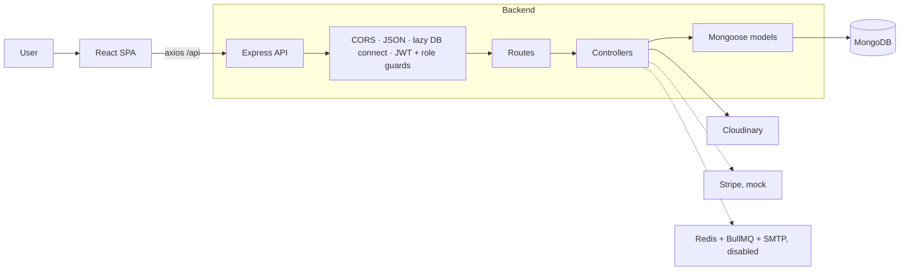
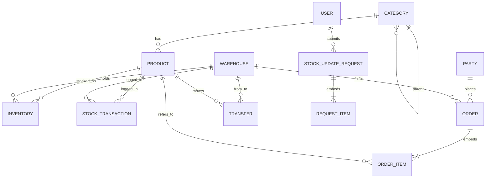

# StockFlow — Multi-Warehouse Inventory & ERP

StockFlow is a full-stack inventory management system for businesses that hold stock in several warehouses. It covers the product catalog, per-warehouse stock, purchase and sales orders, inter-warehouse transfers, an approval workflow for stock changes, reports, and role-based access.

**Live demo:** https://stcok-flow-invertement.vercel.app/

---

## Table of contents

1. [Features](#features)
2. [Tech stack](#tech-stack)
3. [Architecture](#architecture)
4. [Project structure](#project-structure)
5. [Getting started](#getting-started)
6. [Environment variables](#environment-variables)
7. [Roles and permissions](#roles-and-permissions)
8. [Business workflows](#business-workflows)
9. [Database model](#database-model)
10. [API reference](#api-reference)
11. [Deployment](#deployment)
12. [Known limitations](#known-limitations)

---

## Features

### Authentication and users
- Email and password login with JWT (30-day token), passwords hashed with bcrypt.
- Four roles: **Admin**, **Manager**, **Inventory Staff**, **Sales Staff**.
- Role-based sidebar, route guards on the frontend, and `restrictTo` guards on the API.
- Suspended accounts (`status: inactive`) cannot log in or use an existing token.
- The first registered user becomes Admin automatically.
- Admin control panel: create, edit, suspend and delete users, and reset their passwords.
- Audit log of key actions (logins, registrations, order and transfer events, payments, stock requests).

### Catalog
- **Products:** name, SKU (unique), barcode, category, brand, cost and selling price, tax rate (default 18%), unit (piece, kg, box, litre, pack), minimum, maximum and reorder levels, active/inactive status.
- Up to 5 product images per product, uploaded to Cloudinary (local-disk fallback when Cloudinary is not configured).
- **Categories:** unlimited nesting through a parent category.
- **Suppliers and customers:** one "party" model with a `supplier` / `customer` type, plus contact details.
- Search products by name, SKU or barcode.

### Locations
- **Warehouses:** name, location, active/inactive.
- **Branches:** retail branches with manager name and phone. Three sample branches are seeded on first run.

### Inventory
- Stock is tracked per product per warehouse, with `quantity` and `reserved` (available = quantity − reserved).
- Inventory table with search and filters.
- **Export to Excel** (`.xlsx`) of the current stock view.
- **Import stock from Excel or CSV** with automatic column detection (SKU, product code, barcode, HSN and similar headings).
- **Manual stock adjustment** (inward or outward) with a reason.
- Every stock movement is written to a ledger (`StockTransaction`) with previous quantity, new quantity, who did it and a reference number.

### Stock approval workflow
- Adjustments and Excel imports made by non-Admin users are saved as **pending requests** instead of changing stock.
- Admins review requests in *Admin Control → Stock approvals* and approve or reject them (with a rejection reason).
- Admin adjustments apply immediately.

### Purchasing
- Create purchase orders for a supplier and warehouse with multiple line items (`PO-YYYY-NNNN`).
- Status flow: `PENDING → APPROVED → RECEIVED`.
- Receiving goods increases warehouse stock inside a database transaction and writes ledger entries.

### Sales
- Create sales orders for a customer and warehouse (`SO-YYYY-NNNN`). Stock is **reserved** when the order is created.
- Confirm an order to reduce physical stock and release the reservation, or cancel it to release the reservation.
- Confirmation is refused if physical stock is insufficient.

### Payments
- Payment intent and payment confirmation endpoints for sales orders (currently a **mock** Stripe flow, see [Known limitations](#known-limitations)).
- Orders carry a payment status (`UNPAID`, `PAID`, `REFUNDED`) and payment details (transaction id, gateway, amount, date).

### Stock transfers between warehouses
- Create a transfer: available stock at the source is checked and reserved.
- Status flow: `PENDING → IN_TRANSIT → RECEIVED`.
- Dispatch deducts from the source warehouse; receive adds to the destination. Both write ledger entries.

### Notifications and alerts
- Notification bell in the header, refreshed every 20 seconds.
- Low-stock and out-of-stock alerts are calculated live from product reorder levels versus total stock.
- Pending stock requests appear as notifications for approvers.
- Mark a single notification or all notifications as read.
- Low-stock summary endpoint.

### Dashboard and reports
- Dashboard with key totals, a **Sales vs Purchases** bar chart, a **category stock distribution** pie chart, and a list of low-stock and out-of-stock products.
- Reports (Admin and Manager): **Inventory**, **Sales**, **Purchase** and **Stock movement**, each exportable to CSV.

### Interface
- Responsive layout with a slide-over sidebar on mobile.
- Seven colour themes (Corporate Navy, Midnight Amber, Emerald Forest, Royal Violet, Crimson Ruby, Cyber Cyan, Nordic Clean Light) and four fonts (Inter, Outfit, Plus Jakarta Sans, Roboto), saved per browser.
- Code-split pages with skeleton loading states.

### DevOps
- Docker images for backend and frontend, plus `docker-compose.yml` for MongoDB, Redis, backend and frontend.
- Kubernetes manifests in `k8s/` (namespace, config map, secrets, MongoDB, Redis, backend, frontend).
- GitHub Actions pipeline: install, test, build, validate Docker and Kubernetes files, push images to Docker Hub.
- Vercel configuration for the frontend and for the backend as a serverless function.

---

## Tech stack

| Layer | Technology |
|-------|------------|
| Frontend | React 18, Vite 5, Redux Toolkit, React Router 6, React Hook Form, Axios, Recharts, Tailwind CSS 3, Lucide icons, SheetJS (`xlsx`) |
| Backend | Node.js (ES modules), Express 4, Mongoose 8, JSON Web Tokens, bcryptjs, Multer, Cloudinary, Nodemailer, BullMQ, Redis |
| Database | MongoDB 6 (replica set required, see below) |
| Infrastructure | Docker, Docker Compose, Kubernetes, GitHub Actions, Vercel |

---

## Architecture



Solid lines are active. Dashed lines are mocked or switched off in the current code.

---

## Project structure

```
.
├── api/[...path].js        Vercel catch-all that exposes the Express app
├── backend/
│   ├── src/
│   │   ├── app.js          Express app, CORS, route mounting
│   │   ├── config/         db (with seeding), redis, bullmq
│   │   ├── controllers/    Business logic (13 controllers)
│   │   ├── middleware/     auth (protect, restrictTo), error handler
│   │   ├── models/         Mongoose schemas (13 models)
│   │   ├── routes/         Express routers (14 modules)
│   │   └── services/       alertService, emailService, uploadService
│   ├── public/uploads/     Local upload fallback
│   └── Dockerfile
├── frontend/
│   ├── src/
│   │   ├── pages/          Dashboard, Products, Inventory, Sales, ...
│   │   ├── components/     OrderForm, ExcelImportModal, NotificationDropdown, ...
│   │   ├── store/          Redux store and auth slice
│   │   ├── context/        ThemeContext (themes and fonts)
│   │   └── utils/          api (axios), csv, money
│   ├── nginx.conf          SPA hosting and /api proxy for containers
│   └── Dockerfile
├── k8s/                    Kubernetes manifests
├── .github/workflows/      CI/CD pipeline
├── docker-compose.yml
└── vercel.json
```

---

## Getting started

### Prerequisites
- Node.js 18 or newer
- MongoDB **running as a replica set** (the order, transfer and stock code uses transactions). MongoDB Atlas works out of the box.
- Optional: Cloudinary account for image uploads

### 1. Install

```bash
git clone https://github.com/SuriyaPriyanS/StcokFlowInvertement.git
cd StcokFlowInvertement
npm run install:all
```

### 2. Configure the backend

Create `backend/.env`:

```env
PORT=5000
MONGODB_URI=mongodb+srv://<user>:<password>@<cluster>/stockflow
JWT_SECRET=<long random string>
CLOUDINARY_CLOUD_NAME=
CLOUDINARY_API_KEY=
CLOUDINARY_API_SECRET=
```

### 3. Run

```bash
npm run dev
```

This starts the API on http://localhost:5000 and the frontend on http://localhost:3000. In development the frontend proxies `/api` and `/uploads` to the backend, so no CORS setup is needed.

Run each side separately with `npm run backend` or `npm run frontend`.

### First login

On first start with an empty database the API seeds three branches and four users, one per role:

| Role | Email |
|------|-------|
| Admin | admin@stockflow.com |
| Manager | manager@stockflow.com |
| Inventory Staff | inventory@stockflow.com |
| Sales Staff | sales@stockflow.com |

The default passwords are defined in `backend/src/config/db.js`. **Change them immediately** after the first login, and remove or change the seeding before going live.

### Run with Docker

```bash
docker compose up --build
```

Frontend: http://localhost:3000, API: http://localhost:5000. The bundled MongoDB container is a standalone instance, so transactional endpoints will fail until you start it as a replica set or point `MONGODB_URI` at Atlas.

---

## Environment variables

### Backend

| Variable | Required | Purpose |
|----------|----------|---------|
| `MONGODB_URI` | yes | MongoDB connection string |
| `JWT_SECRET` | yes | Secret for signing tokens |
| `PORT` | no | API port, default 5000 |
| `CLOUDINARY_CLOUD_NAME`, `CLOUDINARY_API_KEY`, `CLOUDINARY_API_SECRET` (or `CLOUDINARY_URL`) | no | Image hosting. Without them, files are saved to `public/uploads` |
| `REDIS_URL` | no | Used by the (currently disabled) queue and alerts |
| `SMTP_HOST`, `SMTP_PORT`, `SMTP_USER`, `SMTP_PASS`, `EMAIL_FROM` | no | Low-stock email alerts (currently disabled) |
| `NODE_ENV`, `VERCEL` | no | Set by the platform |

### Frontend

| Variable | Purpose |
|----------|---------|
| `VITE_API_URL` | API base URL used in production builds, for example `https://your-api.vercel.app/api` |

---

## Roles and permissions

| Area | Admin | Manager | Inventory Staff | Sales Staff |
|------|:---:|:---:|:---:|:---:|
| Dashboard, products (view), inventory (view), branches | ✔ | ✔ | ✔ | ✔ |
| Categories, suppliers, warehouses (manage) | ✔ | ✔ | | |
| Customers | ✔ | ✔ | | ✔ |
| Product create / edit | ✔ | ✔ | | |
| Product delete | ✔ | | | |
| Stock adjust / import (applied directly) | ✔ | request | request | |
| Approve or reject stock requests | ✔ | | | |
| Purchase orders: create, approve | ✔ | ✔ | | |
| Purchase orders: receive goods | ✔ | ✔ | ✔ | |
| Sales orders: create, confirm, cancel | ✔ | ✔ | | ✔ |
| Transfers | ✔ | ✔ | ✔ | |
| Reports | ✔ | ✔ | | |
| Admin control (users, audit log, system stats) | ✔ | | | |

"request" means the change is saved as a pending request for an Admin to approve.

---

## Business workflows

**Purchase order**

```
PENDING --approve--> APPROVED --receive--> RECEIVED
                                   └─ stock += qty, ledger entry (PURCHASE)
```

**Sales order**

```
create: reserved += qty
PENDING --confirm--> CONFIRMED   (quantity -= qty, reserved -= qty, ledger entry SALE)
PENDING --cancel---> CANCELLED   (reserved -= qty)
```

**Transfer**

```
create:   source reserved += qty
PENDING --dispatch--> IN_TRANSIT  (source quantity -= qty, ledger TRANSFER_OUT)
IN_TRANSIT --receive--> RECEIVED  (destination quantity += qty, ledger TRANSFER_IN)
```

**Stock adjustment**

```
Admin       -> applied immediately
Other roles -> StockUpdateRequest (PENDING) -> Admin approves or rejects
```

Ledger entry types: `PURCHASE`, `SALE`, `TRANSFER_IN`, `TRANSFER_OUT`, `ADJUSTMENT_IN`, `ADJUSTMENT_OUT`.

---

## Database model



Collections: `users`, `branches`, `categories`, `products`, `warehouses`, `inventory` (unique on product + warehouse), `stockTransactions`, `parties`, `orders` (items embedded), `transfers`, `stockUpdateRequests` (items embedded), `notifications`, `auditLogs`.

---

## API reference

All routes are under `/api`. Everything except the three public auth routes and the payment webhook needs `Authorization: Bearer <token>`.

| Module | Endpoints |
|--------|-----------|
| `/auth` | `POST /register`, `POST /login`, `GET /demo-users`, `GET /me` |
| `/products` | `GET /`, `GET /:id`, `POST /`, `PUT /:id`, `DELETE /:id` (images sent as multipart field `images`, max 5) |
| `/categories` | `GET /`, `POST /`, `PUT /:id`, `DELETE /:id` |
| `/parties` | `GET /`, `POST /`, `PUT /:id`, `DELETE /:id` |
| `/warehouses` | `GET /`, `POST /`, `PUT /:id`, `DELETE /:id` |
| `/branches` | `GET /`, `POST /`, `PUT /:id`, `DELETE /:id` |
| `/inventory` | `GET /`, `POST /adjust`, `POST /import`, `GET /requests`, `PUT /requests/:id/approve`, `PUT /requests/:id/reject` |
| `/orders` | `GET /?type=PURCHASE\|SALE`, `POST /purchase`, `PUT /purchase/:id/approve`, `PUT /purchase/:id/receive`, `POST /sales`, `PUT /sales/:id/confirm`, `PUT /sales/:id/cancel` |
| `/transfers` | `GET /`, `POST /`, `PUT /:id/dispatch`, `PUT /:id/receive` |
| `/payments` | `POST /create-intent`, `POST /confirm-mock-payment`, `POST /webhook` |
| `/reports` | `GET /dashboard-stats`, `GET /inventory`, `GET /sales`, `GET /purchase`, `GET /movement` |
| `/notifications` | `GET /`, `PUT /read-all`, `PUT /:id/read`, `GET /low-stock-summary` |
| `/settings` | `GET /stats`, `GET /audit-logs`, `GET /users`, `POST /users`, `PUT /users/:id`, `DELETE /users/:id`, `PUT /users/:id/password` |
| `/upload` | `POST /` (single image, field `image`, returns the hosted URL) |

Responses use the shape `{ success, data, message }`. Errors return `{ success: false, message }` with a suitable status code.

---

## Deployment

### Vercel (current setup)
- **Frontend project:** root `vercel.json` builds `frontend/` and serves `frontend/dist` with a single-page-app rewrite.
- **Backend project:** `backend/vercel.json` runs `src/app.js` with `@vercel/node`. The root `api/[...path].js` exposes the same app for same-domain deployments.
- Set `VITE_API_URL` on the frontend project to the backend project's `/api` URL.
- Set `MONGODB_URI`, `JWT_SECRET` and the Cloudinary variables on the backend project.

### Docker and Kubernetes
- `docker compose up --build` for a local stack.
- `kubectl apply -f k8s/` after editing `k8s/secrets.yaml` and `k8s/configmap.yaml` with real values. The frontend's nginx proxies `/api` to the in-cluster backend service.

### CI/CD
`.github/workflows/ci-cd.yml` installs dependencies, builds the frontend, validates Docker and Kubernetes files on pull requests, and pushes Docker images on pushes to `master`. Add `DOCKER_USERNAME` and `DOCKER_PASSWORD` as repository secrets.

---

## Known limitations

These are documented so nobody is surprised in production:

- **Payments are a mock.** No Stripe SDK calls are made, and the webhook does not verify signatures.
- **Alerts by email and the Redis queue are disabled** in `app.js`. In-app notifications work.
- **Barcode** is stored and searchable, but there is no camera or scanner input.
- **Image uploads on Vercel** need Cloudinary, because the serverless filesystem is read-only.
- **MongoDB must support transactions** (replica set or Atlas).
- **Default seeded accounts and open registration** must be locked down before real use.

A full list of security and logic findings with file references is in `AUDIT.md`.

https://app.diagrams.net/#G10uRJXnldymBYsLJ7IgnwZHwfhrmNz_BD#%7B%22pageId%22%3A%224k53iLuQVbuLFqnmBL73%22%7D
